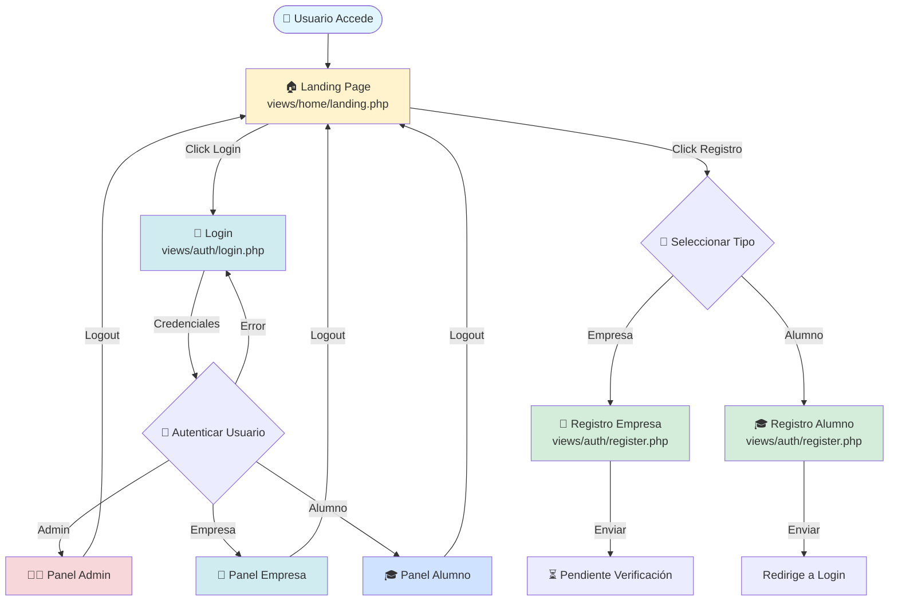
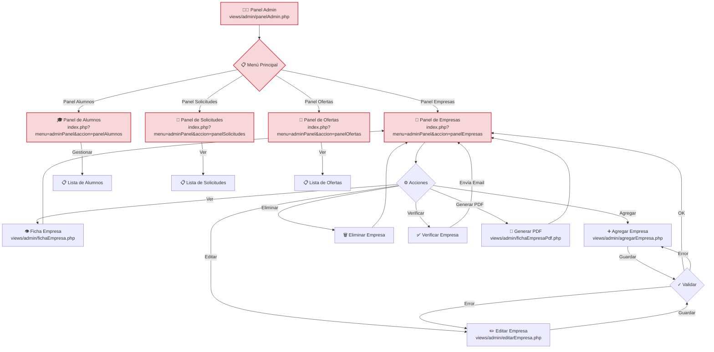
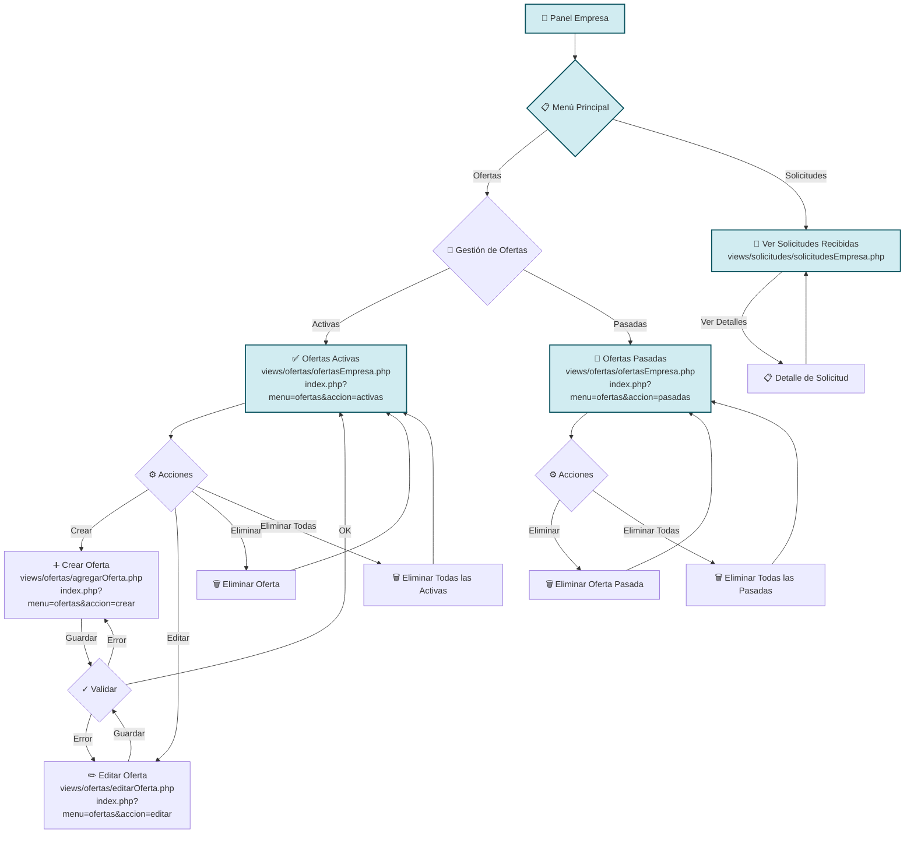
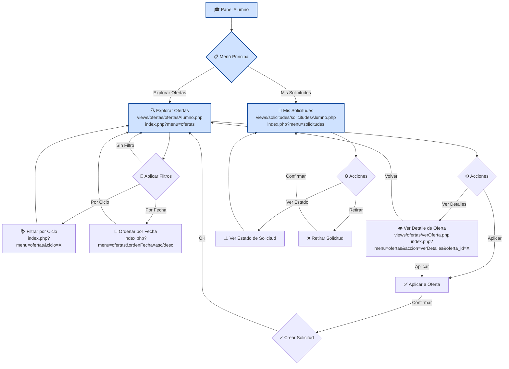
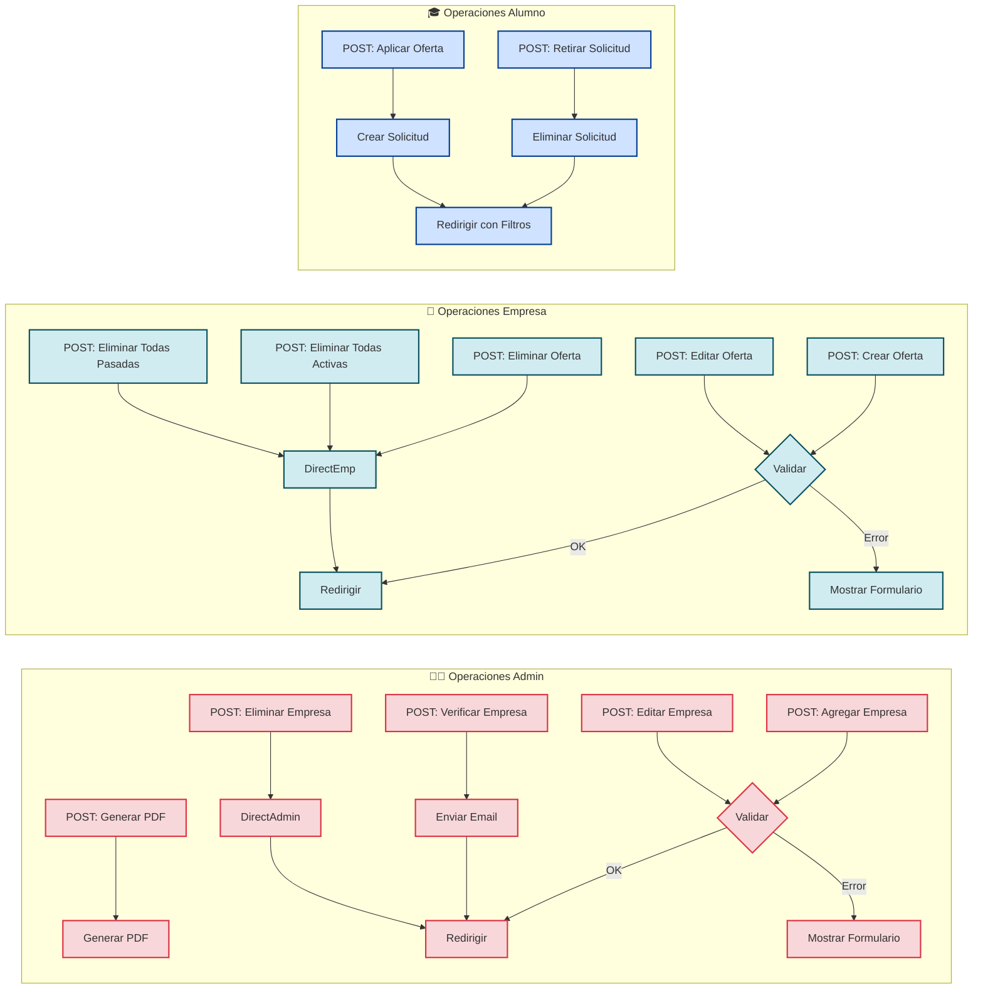

# 🗺️ MAPA DE NAVEGACIÓN - Sistema de Gestión de Ofertas de Prácticas

Este documento contiene los mapas de navegación visuales que muestran el flujo completo de pantallas de la aplicación.

## 📖 Cómo Visualizar los Diagramas

Los diagramas están escritos en sintaxis **Mermaid**, que se renderiza automáticamente en:
- GitHub (vista de archivo)
- GitLab
- Editores compatibles (VSCode con extensión Mermaid, IntelliJ IDEA)
- Visores Markdown online (StackEdit, Dillinger)

Para exportar como imágenes:
1. Usar la extensión de navegador "Mermaid Diagram Exporter"
2. Copiar el código en [Mermaid Live Editor](https://mermaid.live)
3. Usar herramientas CLI como `mmdc` (mermaid-cli)

---

## 🌐 1. DIAGRAMA GENERAL DE FLUJO

Este diagrama muestra el flujo principal de la aplicación desde el punto de entrada hasta la bifurcación por roles.

---

## 👨‍💼 2. DIAGRAMA DE FLUJO - ROL ADMINISTRADOR

El administrador tiene acceso completo a la gestión de empresas, alumnos, ofertas y solicitudes.

---

## 🏢 3. DIAGRAMA DE FLUJO - ROL EMPRESA

Las empresas pueden gestionar sus ofertas activas y pasadas, y ver las solicitudes recibidas.

---

## 🎓 4. DIAGRAMA DE FLUJO - ROL ALUMNO

Los alumnos pueden explorar ofertas, aplicar a ellas y gestionar sus solicitudes.

---

## 📊 5. TABLA RESUMEN DE RUTAS, VISTAS Y CONTROLLERS

| Ruta | Parámetros | Vista | Controller | Rol | Descripción |
|------|-----------|-------|------------|-----|-------------|
| `/` | - | `views/home/landing.php` | `HomeController::landingPage()` | Público | Landing page principal |
| `/?menu=login` | - | `views/auth/login.php` | `AuthController::login()` | Público | Página de inicio de sesión |
| `/?menu=register` | `tipo=empresa/alumno` | `views/auth/register.php` | `AuthController::register()` | Público | Página de registro |
| `/?menu=logout` | - | - | `AuthController::logout()` | Todos | Cerrar sesión |
| `/?menu=adminPanel` | - | `views/admin/panelAdmin.php` | `AdminController::adminPanel()` | Admin | Panel principal del administrador |
| `/?menu=adminPanel&accion=panelEmpresas` | - | `views/admin/panelAdmin.php` | `AdminController::adminPanel()` | Admin | Panel de gestión de empresas |
| `/?menu=adminPanel&accion=panelEmpresas&opcion=ver` | `empresa_id` | `views/admin/fichaEmpresa.php` | `AdminController::adminPanel()` | Admin | Ver ficha de empresa |
| `/?menu=adminPanel&accion=panelEmpresas&opcion=agregar` | - | `views/admin/agregarEmpresa.php` | `AdminController::adminPanel()` | Admin | Formulario agregar empresa |
| `/?menu=adminPanel&accion=panelEmpresas&opcion=editar` | `empresa_id` | `views/admin/editarEmpresa.php` | `AdminController::adminPanel()` | Admin | Formulario editar empresa |
| `/?menu=adminPanel&accion=panelAlumnos` | - | `views/admin/panelAdmin.php` | `AdminController::adminPanel()` | Admin | Panel de gestión de alumnos |
| `/?menu=adminPanel&accion=panelSolicitudes` | - | `views/admin/panelAdmin.php` | `AdminController::adminPanel()` | Admin | Panel de gestión de solicitudes |
| `/?menu=adminPanel&accion=panelOfertas` | - | `views/admin/panelAdmin.php` | `AdminController::adminPanel()` | Admin | Panel de gestión de ofertas |
| `/?menu=ofertas` | - | `views/ofertas/ofertasAlumno.php` | `OfertaController::ofertas()` | Alumno | Explorar ofertas disponibles |
| `/?menu=ofertas` | `ciclo`, `ordenFecha` | `views/ofertas/ofertasAlumno.php` | `OfertaController::ofertas()` | Alumno | Ofertas con filtros |
| `/?menu=ofertas&accion=verDetalles` | `oferta_id` | `views/ofertas/verOferta.php` | `OfertaController::ofertas()` | Alumno | Ver detalles de una oferta |
| `/?menu=ofertas&accion=activas` | - | `views/ofertas/ofertasEmpresa.php` | `OfertaController::ofertas()` | Empresa | Ofertas activas de la empresa |
| `/?menu=ofertas&accion=pasadas` | - | `views/ofertas/ofertasEmpresa.php` | `OfertaController::ofertas()` | Empresa | Ofertas pasadas de la empresa |
| `/?menu=ofertas&accion=crear` | - | `views/ofertas/agregarOferta.php` | `OfertaController::ofertas()` | Empresa | Formulario crear oferta |
| `/?menu=ofertas&accion=editar` | `oferta_id` | `views/ofertas/editarOferta.php` | `OfertaController::ofertas()` | Empresa | Formulario editar oferta |
| `/?menu=solicitudes` | - | `views/solicitudes/solicitudesAlumno.php` | `SolicitudController::solicitudes()` | Alumno | Mis solicitudes enviadas |
| `/?menu=solicitudes` | - | `views/solicitudes/solicitudesEmpresa.php` | `SolicitudController::solicitudes()` | Empresa | Solicitudes recibidas |

---

## 🔄 6. DIAGRAMA DE OPERACIONES POST (Acciones de Formularios)

Este diagrama muestra las operaciones que se realizan mediante formularios POST.

---

## 🎨 7. LEYENDA DE COLORES

Los diagramas utilizan los siguientes códigos de color para diferenciar los roles:

| Color | Rol | Descripción |
|-------|-----|-------------|
| 🔴 Rojo claro (`#f8d7da`) | **Administrador** | Pantallas y operaciones exclusivas del administrador |
| 🔵 Azul claro (`#d1ecf1`) | **Empresa** | Pantallas y operaciones exclusivas de empresas |
| 🟦 Azul oscuro (`#cfe2ff`) | **Alumno** | Pantallas y operaciones exclusivas de alumnos |
| 🟡 Amarillo (`#fff3cd`) | **Público** | Pantallas accesibles sin autenticación |
| 🟢 Verde (`#d4edda`) | **Registro** | Pantallas de registro de nuevos usuarios |

---

## 📝 8. NOTAS TÉCNICAS

### Estructura de Controllers

- **Router.php**: Controlador principal que enruta las peticiones según el parámetro `menu`
- **AuthController.php**: Maneja login, registro y logout
- **HomeController.php**: Muestra la landing page
- **AdminController.php**: Gestiona todas las operaciones del panel de administrador
- **OfertaController.php**: Maneja ofertas tanto para empresas como para alumnos
- **SolicitudController.php**: Gestiona las solicitudes tanto para empresas como para alumnos

### Flujo de Autenticación

1. Usuario accede a `/?menu=login`
2. Envía credenciales por POST
3. `AuthController::login()` valida las credenciales
4. Según el rol (1=Admin, 2=Alumno, 3=Empresa), se establece la sesión
5. Se verifica que el usuario esté activo/verificado
6. Se genera un token de sesión
7. Se redirige a la página principal según el rol

### Sistema de Permisos

- **Admin (rol=1)**: Acceso completo a todos los paneles de administración
- **Alumno (rol=2)**: Acceso a exploración de ofertas y gestión de solicitudes
- **Empresa (rol=3)**: Acceso a gestión de ofertas y visualización de solicitudes
- Las empresas deben estar **verificadas** (`verificada=1`) para acceder
- Los alumnos deben estar **activos** (`activo=1`) para acceder

### Validaciones

- Todas las operaciones de creación y edición pasan por validadores (`Validator.php`)
- Si hay errores de validación, se vuelve a mostrar el formulario con los errores
- Si la validación es correcta, se procesa la operación y se redirige

---

## 🔗 9. REFERENCIAS

### Archivos Principales

- **Routing**: `/controllers/Router.php`
- **Controllers**: `/controllers/*.php`
- **Views**: `/views/**/*.php`
- **Services**: `/services/*.php`
- **Models**: `/models/*.php`
- **Repositories**: `/repositories/*.php`

### APIs Auxiliares

La aplicación también incluye APIs REST en `/public/assets/api/` para operaciones asíncronas:
- `api_oferta.php`: Operaciones de ofertas
- `api_solicitud.php`: Operaciones de solicitudes
- `api_empresa.php`: Operaciones de empresas
- `api_alumno.php`: Operaciones de alumnos
- `api_familia.php`: Obtener familias profesionales
- `api_provincia.php`: Obtener provincias
- `api_imagen.php`: Gestión de imágenes

---

## 📚 10. GLOSARIO

- **Landing Page**: Página de inicio pública de la aplicación
- **CRUD**: Create, Read, Update, Delete (operaciones básicas de base de datos)
- **Oferta**: Oferta de prácticas publicada por una empresa
- **Solicitud**: Aplicación de un alumno a una oferta de prácticas
- **Ciclo**: Ciclo formativo (FP) al que pertenece un alumno
- **Familia Profesional**: Área o sector de formación profesional
- **Verificación**: Proceso de aprobación de una empresa por el administrador
- **Token**: Identificador único de sesión para seguridad

---

**Última actualización**: 2025-11-20

**Versión del documento**: 1.0
